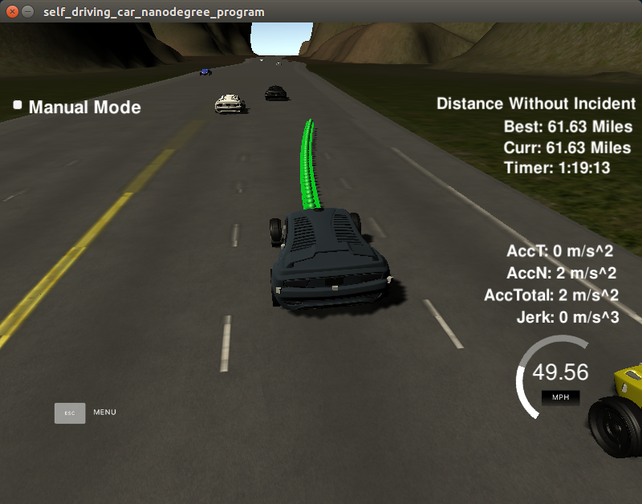
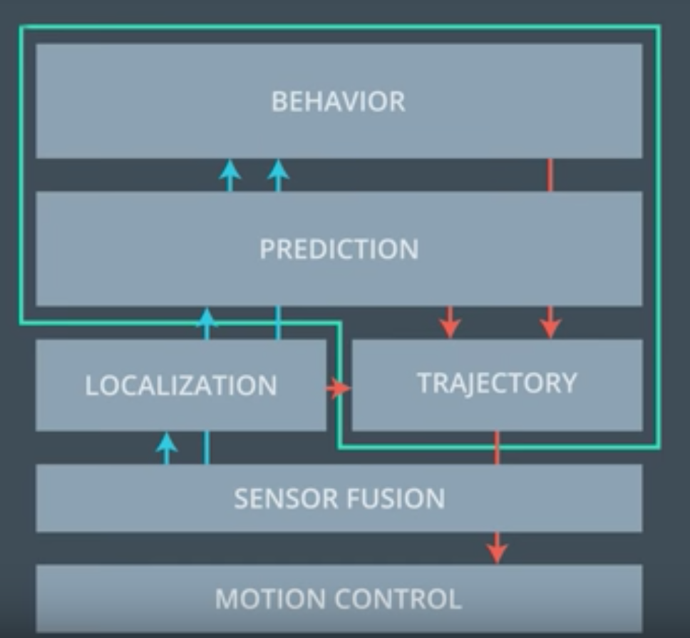
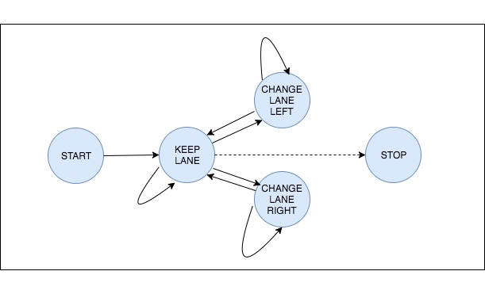
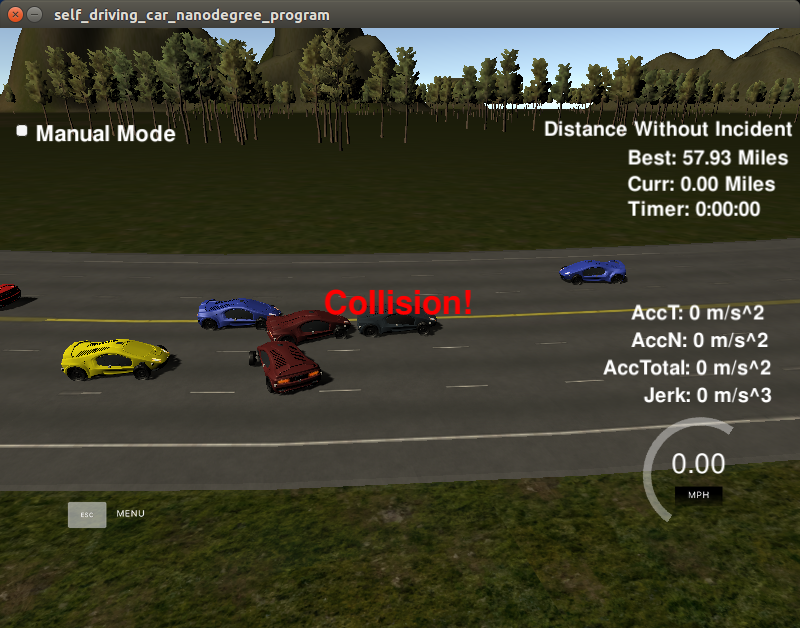

# CarND-Path-Planning-Project
Self-Driving Car Engineer Nanodegree Program
   


## Path Planning in Self-driving Car SW stack


Path planner sits on the very top of the self-driving car’s software stack. Once the car knows where it should go (the route planner has found an approximate route or at least the goal what to reach), the path planner takes care how the car reaches the goal.

In general, a path planner has three sub-components: prediction, behaviour planner and trajectory generator.  Prediction component gets input from localisation (ego vehicle’s position data) and sensor fusion (position data of the surrounding, cars, obstacles etc.). The result of the prediction a set of likely trajectories for the objects. On the basis of these predictions, the route and the state of the vehicle the behaviour module decides what can be done next. Finally, trajectory generator makes a drivable trajectory that should fulfil the decision. 

<figure>

<figcaption>Path planning in the self-driving car SW Stack</figcaption>
</figure>

The actual implementation of the decision and trajectory generation can be very different from situation to situation. Parking lot or urban street driving is very different from highway environment. In this work a simple highway path planner implementation. 

## Path Planner Implementation

### Goals
In this project the goal is to safely navigate around a virtual highway with other traffic that is driving +-10 MPH of the 50 MPH speed limit. Simulator provides the car's localization and sensor fusion data, there is also a sparse map list of waypoints around the highway. The car should try to go as close as possible to the 50 MPH speed limit, which means passing slower traffic when possible, note that other cars will try to change lanes too. The car should avoid hitting other cars at all cost as well as driving inside of the marked road lanes at all times, unless going from one lane to another. The car should be able to make one complete loop around the 6946m highway. Since the car is trying to go 50 MPH, it should take a little over 5 minutes to complete 1 loop. Also the car should not experience total acceleration over 10 m/s^2 and jerk that is greater than 50 m/s^3.


### The solution

#### Prediction

For prediction, we use the provided sensor fusion data to find out the closest car in front and at behind of the ego vehicle. This is done for each lane.  Predicted trajectory is then just the car’s s-position (in Frenet-coordinates) on the target lane. We use here an assumption, that the relative positions of the vehicles on the track do not change very much within the prediction horizon. This assumption does not hold in real traffic, but turned out to be sufficient in the simulated environment. 

#### Behaviour planning

The behaviour planner, `Vehicle::update_state()`, is a finite state machine with the following states

- START 
- KEEP LANE
- CHANGE LANE RIGHT
- CHANGE LANE LEFT
- STOP

Valid state transitions are show below:

<figure>

<figcaption>Vehicle's states and state transitions</figcaption>
</figure>

The states are mostly self-explanatory. START-state is for accelerating from a stand still position to highway speed. This state uses different acceleration profile than other states.

STOP-state is not implemented yet (This is a circular track). It should pull over the vehicle to the shoulder.

**State cost estimation**

`Vehicle::calculate_cost()` estimates cost for each state transition. The cost is a combination of the following sub-costs:

- Collision penalty: This cost term penalises of collision to another vehicle or driving of the road.   There is also a smaller penalty, if another vehicle is close, but not actually colliding.
- Slow speed penalty: This cost term calculates the difference between the speed limit and current vehicle in the front of the ego vehicle. The penalty is directly proportional to the magnitude of the difference.
- Free space reward: This cost term rewards the free space in the front (i.e. how far the next car in front is) and the reward is directly proportional to the length of the free space. Maximum reward is given when there is 75 meters or more free lane ahead.
- Keep lane reward: There is a small reward for keeping the ego lane. The purpose of this term is to prevent the car swaying between lanes when the other cost terms give approximately equal result for two adjacent lanes, and not to change lanes when the conditions are equal.

The state with lowest cost is selected as a next state.

**Realize state**

`Vehicle::realize_state()` calculates the target_lane and the target_speed for the minimal cost state. On speed calculation, we take in account the speed of the vehicle in front of us, and the distance to the vehicle.

### Trajectory generator

Vehicle’s trajectory is generated based on the target speed and target lane from the behaviour planner. The generated trajectory consist of 50 points in the global cartersian coordinates. The simulator consumes one point every 20 ms. This means, that the horizon of the trajectory is one seconde, and that the speed and acceleration of the vehicle is determined by the spacing of the points. 

On each generation round, the generator reuses ten points of the previous trajectory. This is done in order to provide a smooth transition from the old trajectory to the new one. It also means, that the vehicle has 0.2 seconds ‘reaction time’.

We use a [spline-library](http://kluge.in-chemnitz.de/opensource/spline/) to generate the trajectory curve. The base point for the spline is the last reused point (at the beginning, car’s position). 
For end points the generator uses Frenet coordinates with s-coordinate 40 and 80 meters away from the base point. The d-coordinate of these points is the centre of the target lane. These reference points are converted to vehicle’s cartesian coordinate space (the base point as origin) before fitting to aspline. For the final trajectory, car coordinates are transformed to global cartesian (x,y) space. 

For spacing of the points (which determines speed and acceleration) the trajectory generator has two different approaches. On STATE-state, the generated points have fixed distance (constant speed). The behaviour planner changes the target speed in 0.2 m/s increments, which makes the vehicle to accelerate. Later, when higher speed is reached, the acceleration is logarithmic in a way, that the closer we are the target speed, the less we accelerate.

### Source files

- `main.cpp`: Takes care of object instantiation (HighwayMap, TrajectoryGenerator, Vehicle) and communicates with the simulator
- `HighwayMap.h/.cpp`: Container class for the current route, waypoints and road information
- `Vehicle.h/.cpp`: Vehicle status and behaviour logic.
- `TrajectoryGenerator.h/.cpp`: Vehicle's trajectory generator.
- `helpers.h/.cpp`: Helper routines for conversions etc.
- `spline.h/.cpp`: spline library from 


### Discussion and future work

The path planner is designed for a very limited simulator environment. In order to make it more general, it needs some improvements.

- The behaviour planner needs more accurate predicted ego-trajectory and real predictions of other vehicle’s trajectories within the planning horizon.
- Maybe add states for "prepare lane change" in order to actively look for possibility for lane change when the ego vehicle gets stuck behind a slower car..
- Maybe add more cost considerations for example reward lane change when the lane after next lane is a fast lane. Also, there could be a penalty for lanes with a lot of vehicles (congestion cost). On the other hand, the more cost combinations we have, the more difficult it is to find good balance between them.
- Trajectory generator uses a simple spline approach. In a more sophisticated version, we would have the trajectory generator to prepare several jerk minimising trajectories among which we could choose the most appropriate one.
- Also, more fine grained control of speed and path could be achieved by adding motion controller (PID or MPC) after the trajectory generator.




## Building and running

### Simulator.
You can download the Term3 Simulator which contains the Path Planning Project from the [releases tab (https://github.com/udacity/self-driving-car-sim/releases).

#### The map of the highway is in data/highway_map.txt
Each waypoint in the list contains  [x,y,s,dx,dy] values. x and y are the waypoint's map coordinate position, the s value is the distance along the road to get to that waypoint in meters, the dx and dy values define the unit normal vector pointing outward of the highway loop.

The highway's waypoints loop around so the frenet s value, distance along the road, goes from 0 to 6945.554.

### Basic Build Instructions

1. Clone this repo.
2. Make a build directory: `mkdir build && cd build`
3. Compile: `cmake .. && make`
4. Run it: `./path_planning`.

## Data and simulator description

Here is the data provided from the Simulator to the C++ Program

#### Main car's localization Data (No Noise)

["x"] The car's x position in map coordinates

["y"] The car's y position in map coordinates

["s"] The car's s position in frenet coordinates

["d"] The car's d position in frenet coordinates

["yaw"] The car's yaw angle in the map

["speed"] The car's speed in MPH

### Previous path data given to the Planner

//Note: Return the previous list but with processed points removed, can be a nice tool to show how far along
the path has processed since last time. 

["previous_path_x"] The previous list of x points previously given to the simulator

["previous_path_y"] The previous list of y points previously given to the simulator

### Previous path's end s and d values 

["end_path_s"] The previous list's last point's frenet s value

["end_path_d"] The previous list's last point's frenet d value

#### Sensor Fusion Data, a list of all other car's attributes on the same side of the road. (No Noise)

["sensor_fusion"] A 2d vector of cars and then that car's [car's unique ID, car's x position in map coordinates, car's y position in map coordinates, car's x velocity in m/s, car's y velocity in m/s, car's s position in frenet coordinates, car's d position in frenet coordinates. 

### Simulator 

1. The car uses a perfect controller and will visit every (x,y) point it recieves in the list every .02 seconds. The units for the (x,y) points are in meters and the spacing of the points determines the speed of the car. The vector going from a point to the next point in the list dictates the angle of the car. Acceleration both in the tangential and normal directions is measured along with the jerk, the rate of change of total Acceleration. The (x,y) point paths that the planner recieves should not have a total acceleration that goes over 10 m/s^2, also the jerk should not go over 50 m/s^3. (NOTE: As this is BETA, these requirements might change. Also currently jerk is over a .02 second interval, it would probably be better to average total acceleration over 1 second and measure jerk from that.

2. There will be some latency between the simulator running and the path planner returning a path, with optimized code usually its not very long maybe just 1-3 time steps. During this delay the simulator will continue using points that it was last given, because of this its a good idea to store the last points you have used so you can have a smooth transition. previous_path_x, and previous_path_y can be helpful for this transition since they show the last points given to the simulator controller with the processed points already removed. You would either return a path that extends this previous path or make sure to create a new path that has a smooth transition with this last path.

---

## Dependencies

* cmake >= 3.5
 * All OSes: [click here for installation instructions](https://cmake.org/install/)
* make >= 4.1
  * Linux: make is installed by default on most Linux distros
  * Mac: [install Xcode command line tools to get make](https://developer.apple.com/xcode/features/)
  * Windows: [Click here for installation instructions](http://gnuwin32.sourceforge.net/packages/make.htm)
* gcc/g++ >= 5.4
  * Linux: gcc / g++ is installed by default on most Linux distros
  * Mac: same deal as make - [install Xcode command line tools]((https://developer.apple.com/xcode/features/)
  * Windows: recommend using [MinGW](http://www.mingw.org/)
* [uWebSockets](https://github.com/uWebSockets/uWebSockets)
  * Run either `install-mac.sh` or `install-ubuntu.sh`.
  * If you install from source, checkout to commit `e94b6e1`, i.e.
    ```
    git clone https://github.com/uWebSockets/uWebSockets 
    cd uWebSockets
    git checkout e94b6e1
    ```


